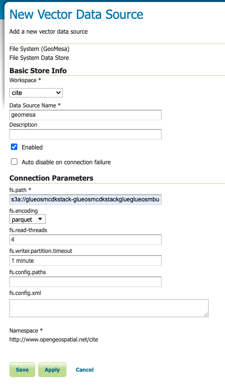
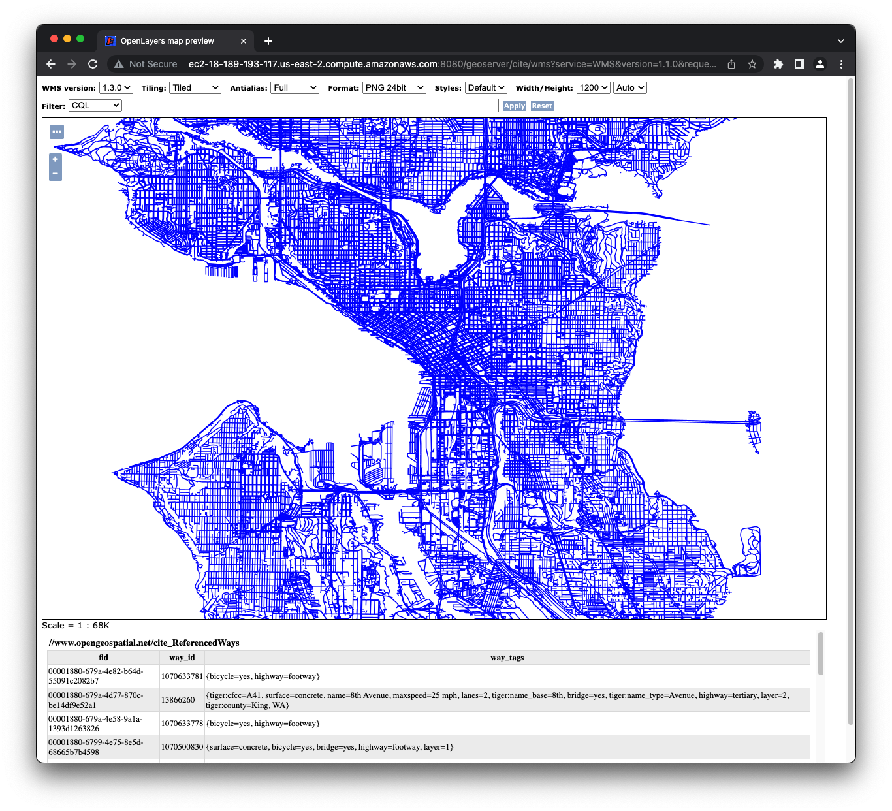

# Glue Scala OpenStreetMap Job with GeoMesa
This repository demonstrates a Glue job written in Scala that reads [OpenStreetMap Open Data on AWS](https://registry.opendata.aws/osm/) and uses [GeoMesa](https://www.geomesa.org/) to spatially partition data in S3 and visualize the results with [GeoServer](https://geoserver.org/).

### OpenStreetMap data with AWS Glue
OpenStreetMap (OSM) is an open source map of the world that can be easily accessed from Open Data on AWS and processed with Spark using AWS Glue jobs.  With the help of GeoMesa libraries for Spark, Glue jobs can read and write geospatial data types like Point, LineString, and Polygon, and perform spatial operations on them like intersections that form the basis of many spatial processing pipelines.  In addition, GeoMesa enables efficiently storing and partitioning data in cloud data stores like an S3 data lake.  

### Spatial Partitioning
Partitioning data in a data lake is critical to achieving performance and scale so that queries may read only the portions of data necessary for a given query.  When queries use spatial filters like bounding box searces, having a spatial dimension to the partition structure significantly reduces the amount of data that must be scanned to find records matching the query.  Many tools exist like Glue Crawlers and Data Catalog that aid in [effectively partitioning](https://aws.amazon.com/blogs/big-data/work-with-partitioned-data-in-aws-glue/) along common dimensions in data such as time or customer.  But choosing a spatial dimension is not immediately available from common fields like latitude and longitude or Well-Known-Text (WKT) represenations of location.  However, approaches exist that can translate these inputs into values that can be used as partitions.      
### Z-Order Curve Index
A [z-order curve](https://en.wikipedia.org/wiki/Z-order_curve) maps multi-dimensional data, in this case y and x or latitude and longitude, into a single dimension.  These values can be used as keys in key-value data stores like NoSQL databases or in this case in S3 as partitioned folders of the spatial data.  When querying the data, input geometries like bounding boxes can also be translated into z-curve values, and are provided as predicates to the query.  The query engine uses these values to read only the partitions that may contain matching results.


A [geohash](https://en.wikipedia.org/wiki/Geohash) is one such application of a z-order curve and can be used in this type of partitioning.  AWS tools like Athena and Redshift have spatial functions and can also be used to [geospatially partition](https://aws.amazon.com/blogs/publicsector/how-partition-geospatial-data-lake-analysis-amazon-redshift/) data in S3 and work well especially for point-based (lat/lon) geometry.  When working with other types of geometry, however, challenges arise for data that may fall into more than one partition like when [working with OpenStreetMap data](https://aws.amazon.com/blogs/big-data/querying-openstreetmap-with-amazon-athena/).


### GeoMesa
[GeoMesa](https://www.geomesa.org/) is an open source suite of tools that enables large-scale geospatial querying and analytics on distributed computing systems. It provides a library for Spark that enables Spark SQL and Glue jobs to support geospatial functions and data, and can read and write efficiently stored formats and partitions to S3 so that Spark and SparkSQL queries can use them in query optimizations like predicate pruning.  It can also be used from Jupyter Notebooks, or read by other open source tools like GeoServer to provide interactive visualization and analysis in GIS tools.


### CDK
The project has been built with AWS CDK to provision an example Glue Job and an EC2 instance with GeoMesa-enabled GeoServer to visualize the result.

### Building and deploying
[Installing with CDK](https://docs.aws.amazon.com/cdk/v2/guide/getting_started.html):
```
npm install -g aws-cdk
cdk bootstrap aws://ACCOUNT-NUMBER/REGION
cdk deploy
```
CDK install script uses Scala's sbt build tool to package a "fat-jar" for the Glue job.  Then invokes the CDK app build that uses the jar and other assets to provisioning the Glue job and EC2 GeoServer.

### Running the Glue job
Run the OsmLoad Glue job in the AWS Console


It writes the results to S3 in partitioned folders and files that GeoMesa can translate into ranges along its Z-Curve index.


Connect to the GeoServer instance at `https://<ec2-instance-address>:8080/geoserver` with credentials `admin` / `geoserver` and choose 'New Data Store' to configure the File System (GeoMesa) source:


And provide the location of the S3 data in the bucket created by CDK and written by the Glue job `s3a://<glue-osm-scala-cdk-bucket>/osm.  It is important to use the 's3a' schema for the bucket location:



Publish the new layer:


And configure its boundaries by selecting the 'Compute from data' and 'Compute from native bounds' options:


With the new layer created, select 'Layer Preview' in the left-hand menu and then the 'OpenLayers' option next to the newly created layer:


The layer is visible to view, and ready for GeoServer to serve as a source to web applications or GIS:


